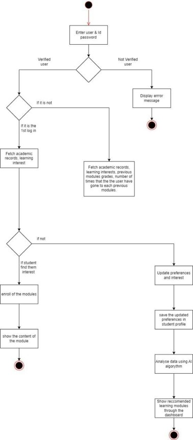

# Systems Analysis & Design — Student Development Platform Requirements Modeling

## Problem
Universities support students academically but rarely track their whole development (academic performance, mental health, social-emotional growth, and extracurricular activity) in one connected system. This project analyzes requirements for an AI-Driven Holistic Student Development System that unifies these areas and models the system end-to-end using UML.

## What the System Does
- **Unified student profiles** — consolidates academic records, extracurricular activity, behavioral data, and counseling/health notes into one profile, with role-based access for students, lecturers, counselors, and admins
- **Personalized learning** — uses AI to analyze academic history and interests, then recommends resources and generates adaptive learning paths; gives lecturers AI-suggested content and lesson-planning support
- **Mental health monitoring & support** — flags stress/anxiety indicators from behavioral data and alerts counselors; offers a 24/7 AI chatbot that can escalate to a human counselor; lets counselors log and manage sessions
- **SEL (Social-Emotional Learning) program management** — supports creating SEL activities, tracking participation, and periodically evaluating emotional intelligence and social skills
- **Project & task management** — lets students and club/project leaders create projects, form teams, and assign/track tasks with difficulty ratings and deadlines
- **Centralized communication** — messaging and automated notifications across all user roles for deadlines, sessions, and updates

## Approach
- Elicited functional requirements across 6 modules (profile management, personalized learning, counseling, SEL, project/task management, communication) and documented them as structured **use case descriptions**
- Defined **non-functional requirements** — sub-2-second response time, 1000+ concurrent users, 99.9% uptime, data encryption, role-based access control
- Modeled system scope and actor interactions with a **use case diagram**
- Modeled key workflows (student enrollment to a project, personalized learning module delivery) with **activity diagrams**
- Modeled system structure and data relationships with a **class diagram** (student, lecturer, counselor, learning resource, assignment, SEL program, project, task, and notification objects)
- Modeled object interactions for core features (AI chatbot, lecturer actions) with **sequence diagrams**

## Tools
draw.io 

## Outcome
A complete, traceable requirements-to-design package — functional and non-functional requirements, actor/use case modeling, workflow modeling, data structure design, and object interaction modeling — suitable as a blueprint for development handoff.

## Artifacts

### Use Case Diagram

### Class Diagram

### Activity Diagram — Student Enrollment to a Project

### Sequence Diagram — AI Chatbot

Full use case descriptions and additional diagrams are available in [`/Diagrams`](Diagrams/).

